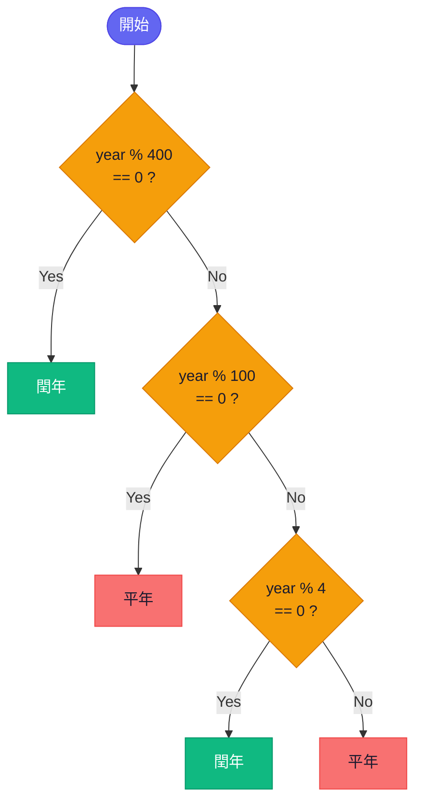

<!-- VISUAL-STYLE-PREFIX: American stick figure comic strip, clean black ink on white background, minimalist line art, 4-panel horizontal layout, numbered panels 1-4, expressive stick figures with simple dot eyes and line mouths, humorous tone, dialogue-driven narrative with speech bubbles only and no narration boxes, speech bubble text in Traditional Chinese Taiwan usage with technical terms in English, consistent character design across all panels -->

# 布林值與流程控制：人生的十字路口

你每天早上起床做的第一件事是什麼？

看窗外。如果下雨→帶傘。如果大太陽→戴墨鏡。如果颱風天→翻身繼續睡。

恭喜你，你剛剛在腦中執行了一段 `if-elif-else` 程式。

「老師，我每天起床只想繼續睡而已 ༼ ༎ຶ ෴ ༎ຶ༽ 」

我也是。但重點是：你的大腦每秒都在做「判斷」。而到目前為止，我們寫的程式只能「從頭到尾」一路跑下去，完全不會轉彎。今天，我們就要讓程式也學會「看情況做決定」。


> 📷 **圖 9**：天氣決策的日常 if-else 四格漫畫（AI 製圖）

---

💡 📋 **學習目標**

看完這一節，希望你將能夠：

1. 理解布林值（Boolean）— 世界上最簡單的資料型別，只有 `True` 和 `False`
2. 使用比較運算子（`==`, `!=`, `>`, `<`, `>=`, `<=`）
3. 使用邏輯運算子（`and`, `or`, `not`）組合多個條件
4. 寫出 `if`、`if-else`、`if-elif-else` 流程控制
5. 畫流程圖（Flowchart）來整理判斷邏輯
6. 解一道經典的閏年判斷器！

---

到目前為止，你學了三種資料型別：整數、浮點數、字串。但要讓程式「做判斷」，我們還需要一種超級簡單、卻超級重要的新型別。它只有兩個值，卻是整個流程控制的基礎。

## 布林值 — 世界上只有兩種答案

### 最簡單的型別

在 1-2 我們學了 `int`、`float`、`str`。現在來認識第四種型別：**布林值（Boolean，bool）**。

它只有兩個值：`True`（真）和 `False`（偽）。

沒了。就這兩個。

「這跟 0 跟 1 有什麼不一樣？」

本質上是一樣的。電腦的世界就是二元的：開/關、有/沒有、是/不是。布林值就是把這個二元世界，用人類看得懂的方式表達出來。

### 比較運算子

如何產生布林值？最常見的方式就是「比較」：

```python
print(3 > 2)    # True（3 比 2 大嗎？是）
print(5 == 5)   # True（5 等於 5 嗎？是）
print(4 < 1)    # False（4 比 1 小嗎？不是）
```

完整的比較運算子：

| 運算子 | 意思 | 範例 | 結果 |
|--------|------|------|------|
| `==` | 等於 | `5 == 5` | `True` |
| `!=` | 不等於 | `5 != 3` | `True` |
| `>` | 大於 | `7 > 3` | `True` |
| `<` | 小於 | `2 < 1` | `False` |
| `>=` | 大於等於 | `5 >= 5` | `True` |
| `<=` | 小於等於 | `3 <= 4` | `True` |

⚠️ **超級重要**：`==`（兩個等號）是「比較」，`=`（一個等號）是「指派」。

```python
x = 5       # 指派：把 5 存進 x
x == 5      # 比較：x 等於 5 嗎？→ True
```

這是初學者出錯率 No.1 的地方。如果你在 `if` 裡面寫成 `x = 5` 而不是 `x == 5`，程式的行為會完全不同（而且 Python 通常會直接報錯 Σ(ﾟДﾟ；≡；ﾟдﾟ) ）。

### 邏輯運算子

有時候一個條件不夠，你需要「組合」多個條件：

```python
score = 75
attendance = 85

# 成績 >= 60 「而且」出席率 >= 80 才及格
passed = score >= 60 and attendance >= 80
print(passed)   # True（兩個條件都滿足）
```

三個邏輯運算子：

| 運算子 | 意思 | 規則 |
|--------|------|------|
| `and` | 而且 | 兩邊都要 `True`，結果才是 `True` |
| `or` | 或者 | 只要一邊是 `True`，結果就是 `True` |
| `not` | 相反 | 把 `True` 變 `False`，`False` 變 `True` |

⚠️ **常見錯誤**：想寫「分數介於 60 到 80 之間」時，不能寫 `score >= 60 and <= 80`。Python 不會幫你自動補上前面的變數，必須寫成 `score >= 60 and score <= 80`。

為了讓你感受 `and` / `or` 在真實場景中怎麼用，我們拿你每天會碰到的高中生活來舉例：

```python
# 社團活動：高一 or 高二 才能報名
grade = 1
can_join = grade == 1 or grade == 2
print(can_join)   # True

# 段考免補考：三科都及格
chinese = 70
math = 55
english = 80
no_makeup = chinese >= 60 and math >= 60 and english >= 60
print(no_makeup)  # False（數學不及格 QQ）
```


> 📷 **圖 10**：比較運算子與邏輯運算子的概念圖（AI 製圖）

---

好，你現在會讓電腦問是非題了：「這個數字大於 60 嗎？」「兩個條件都成立嗎？」電腦會回答 `True` 或 `False`。但光問問題還不夠，你還需要根據答案做出不同的反應。接下來，我們就要讓程式學會「看答案行動」。

## `if-elif-else` — 讓程式學會選擇

這一節會從最簡單的 `if` 開始，一路教到多層判斷。先來理解「為什麼需要它」。

### 為什麼需要流程控制？

到目前為止，我們的程式都是「直線型」：第一行跑完跑第二行，第二行跑完跑第三行，永遠不會跳過任何一行。

但現實世界不是直線的。為了讓你理解這件事，讓我們用一個你每天都會碰到的情境來打比方：你去超商買東西：

- 如果帶了會員卡 → 打 95 折
- 如果沒帶 → 原價

這就是**流程控制（Flow Control）**：讓程式根據條件，決定要走哪條路。好，概念有了，讓我們看看程式碼怎麼寫。

### `if`：最基本的判斷

來看最基本的 `if` 長什麼樣子：

```python
score = int(input())

if score >= 60:
    print("及格！")
```

如果 `score >= 60` 是 `True`，就執行 `print("及格！")`。如果是 `False`，就什麼都不做，直接跳過。

⚠️ **超級重要：縮排（Indentation）**

看到 `print("及格！")` 前面的空格了嗎？那不是裝飾用的。

Python 用**縮排**（通常是 4 個空格）來分辨：「哪些程式碼是屬於這個 `if` 的」。如果你忘了縮排，Python 會直接報錯。來看看正確和錯誤的對比：

```python
if score >= 60:
    print("及格！")      # ✅ 有縮排 → 屬於 if
    print("恭喜你")      # ✅ 也有縮排 → 也屬於 if
print("考試結束")        # ❌ 沒縮排 → 不屬於 if，無論如何都會執行
```

（我知道這很煩，但 Python 就是靠縮排活的。接受它，愛上它 ʅ（´◔౪◔）ʃ ）

### `if-else`：二選一

只有 `if` 的話，條件不成立時什麼都不會發生。如果你想「不及格的時候也說句話」，就用 `else`：

```python
score = int(input())

if score >= 60:
    print("及格！")
else:
    print("不及格，加油！")
```

如果條件成立 → 走 `if` 這條路。否則 → 走 `else` 那條路。二選一，必走一條。

### `if-elif-else`：多選一

如果選項不只兩個呢？用 `elif`（else if 的縮寫）：

```python
score = int(input())

if score >= 90:
    print("優等")
elif score >= 80:
    print("甲等")
elif score >= 70:
    print("乙等")
elif score >= 60:
    print("丙等")
else:
    print("不及格")
```

Python 會**從上到下**依序檢查每個條件，遇到第一個 `True` 就進去執行，然後**跳過剩下所有的 elif/else**。

「老師，那如果 score 是 95，它會同時印『優等』和『甲等』嗎？」

不會。Python 從上往下檢查，`95 >= 90` 是 `True` → 印「優等」→ 直接跳出整個 if-elif-else。不會再往下看了。

### 巢狀 `if`：判斷裡面還有判斷

有時候一層判斷不夠：

```python
has_card = True
total = 200

if total >= 100:
    if has_card:
        print("打 95 折！")
    else:
        print("原價，建議辦卡")
else:
    print("未達折扣門檻")
```

這就是**巢狀 if（Nested If）**：if 裡面還有 if。

（我們這章最多只教兩層巢狀。超過兩層的話，通常代表你的邏輯需要重新整理，而不是繼續往裡面塞 ╮(╯_╰)╭ ）


> 📷 **圖 11**：if-elif-else 的流程圖（AI 製圖）

---

好啦，巢狀 if 不用怕，兩層就夠用了。你現在會寫 `if`、`if-else`、`if-elif-else`，甚至巢狀 if 了。但當條件越來越多，光靠腦袋想容易漏掉分支。有沒有什麼方法可以把邏輯「看見」？有的，而且你可能在數學課見過類似的東西。

## 流程圖 — 把邏輯畫出來

流程圖是一種把判斷邏輯畫成圖的方法。先來看看它為什麼有用。

### 為什麼要畫流程圖？

當判斷條件變多、巢狀越深的時候，光靠腦袋想很容易漏掉某個分支。**流程圖（Flowchart）**讓你把邏輯「看見」。

### 基本符號

| 形狀 | 意思 | 用途 |
|------|------|------|
| 橢圓形 ⬭ | 開始 / 結束 | 流程的起點和終點 |
| 菱形 ◇ | 判斷 | 放條件，分出 Yes / No 兩條路 |
| 矩形 □ | 動作 | 執行某件事（如 print） |
| 箭頭 → | 流向 | 表示程式的執行方向 |

記住這些符號之後，來用它們畫一張真正的流程圖。

### 實戰：閏年判斷的流程圖

閏年規則：

1. 能被 400 整除 → 閏年
2. 能被 100 整除 → 平年
3. 能被 4 整除 → 閏年
4. 其他 → 平年

「這跟數學課的因式分解一樣，順序很重要 ლ(´•д• ̀ლ ？」

沒錯！先檢查 400，再檢查 100，最後檢查 4。如果順序搞錯，結果就會不對。

用流程圖畫出來：



畫完流程圖之後，翻譯成 Python 就變得很機械化：每個菱形變 `if`，每個矩形變 `print()`。


> 📷 **圖 12**：閏年判斷流程圖的概念圖（AI 製圖）

---

布林值會了、`if-elif-else` 會了、流程圖也畫了。是時候把這些武器全部組合起來，挑戰一道經典的 Judge 題目。這題會用到你今天學的所有東西：比較、邏輯運算、多層判斷、還有「順序的陷阱」。

## Judge 解題實戰：閏年判斷器

深呼吸，我們一步一步來。先看題目要求什麼。

### 題目說明

- **Input**：一個正整數 Y（西元年份）
- **Output**：如果是閏年輸出 `Leap Year`，否則輸出 `Common Year`

### 閏年規則（再複習一次）

1. 能被 4 整除**但不能**被 100 整除 → 閏年
2. 能被 400 整除 → 閏年
3. 其他 → 平年

### 範例

| Input | Output |
|-------|--------|
| `2024` | `Leap Year` |
| `1900` | `Common Year` |
| `2000` | `Leap Year` |

> [!NOTE] 老師的建議
> 先試著往前翻找資訊，自己完成挑戰！
>
> 若真的卡關太久，再往下看詳解吧！

<ChallengeLink slug="leap-year" />

先別急著寫程式，我們照 IPO 的思路拆解：

### Step 1：分析 IPO

- **I**：讀取一個整數（年份）
- **P**：用 if-elif-else 判斷閏年規則
- **O**：印出 `Leap Year` 或 `Common Year`

「老師，IPO 拆解完了，接下來呢？」

### Step 2：把規則轉成布林表達式

閏年的條件可以用一行布林表達式寫出來：

```python
(year % 4 == 0 and year % 100 != 0) or (year % 400 == 0)
```

分解一下：

- `year % 4 == 0` → 能被 4 整除嗎？
- `year % 100 != 0` → 不能被 100 整除嗎？
- 上面兩個用 `and` 串起來 → 「能被 4 整除，但不能被 100 整除」
- `year % 400 == 0` → 能被 400 整除嗎？
- 兩組用 `or` 連起來 → 「上面成立，或者能被 400 整除」

用 `year = 1900` 走一遍求值過程：

1. `1900 % 4` → `0`，`0 == 0` → `True`
2. `1900 % 100` → `0`，`0 != 0` → `False`
3. `True and False` → `False`（左半邊不成立）
4. `1900 % 400` → `300`，`300 == 0` → `False`
5. `False or False` → `False` → 不是閏年 ✓

還記得 1-1 的 `print(1+1)` 和 1-2 的 `int(input())` 嗎？同樣的道理：Python 先算最裡面的運算，再一層一層往外組合。布林運算也是先算 `%`，再算 `==`/`!=`，接著 `and`，最後 `or`。

### Step 3：寫程式碼

有了布林表達式，直接塞進 `if` 就搞定了：

```python
year = int(input())

if (year % 4 == 0 and year % 100 != 0) or (year % 400 == 0):
    print("Leap Year")
else:
    print("Common Year")
```

或者，用流程圖的思路，寫成多層 if-elif-else：

```python
year = int(input())

if year % 400 == 0:
    print("Leap Year")
elif year % 100 == 0:
    print("Common Year")
elif year % 4 == 0:
    print("Leap Year")
else:
    print("Common Year")
```

兩種寫法都是正確的。第一種更精簡，第二種更直觀（對應流程圖的每個菱形）。能寫出任一種，都代表你真的懂了 ٩(๑•̀ω•́๑)۶

### Step 4：測試邊界案例

| 年份 | 預期輸出 | 原因 |
|------|----------|------|
| 2024 | Leap Year | 能被 4 整除，不能被 100 整除 |
| 1900 | Common Year | 能被 100 整除，但不能被 400 整除 |
| 2000 | Leap Year | 能被 400 整除 |
| 2023 | Common Year | 不能被 4 整除 |

### Step 5：常見錯誤

❌ **檢查順序搞混**

如果你先檢查 `% 4 == 0`，然後才檢查 `% 100 == 0`，像這樣：

```python
if year % 4 == 0:
    print("Leap Year")     # 1900 會跑到這裡，但 1900 不是閏年！
elif year % 100 == 0:
    print("Common Year")   # 永遠跑不到
```

1900 能被 4 整除，所以第一個 `if` 就通過了，直接印 `Leap Year`，但 1900 其實不是閏年。這就是為什麼順序很重要！

❌ **忘記 400 的特例**

2000 年是閏年（能被 400 整除），但如果你只寫了「能被 100 整除就是平年」，2000 就會被判成平年。（這個 bug 曾經在真實世界造成過大麻煩呢 (ﾟДﾟ；) ）

這些血淚教訓告訴我們一件事：當條件之間有「包含關係」（能被 400 整除 ⊂ 能被 100 整除 ⊂ 能被 4 整除），一定要**從最特殊的條件開始檢查**，避免被更寬泛的條件先攔截。

> [!NOTE] 📌 核心觀念
> 條件有包含關係時，**從最特殊的開始判斷**。這個原則不只適用於閏年，任何多層 `if-elif` 都一樣。

---

恭喜你搞定了閏年判斷器！現在你已經掌握了 `if-elif-else` 的核心武功。不過，光看老師的範例跟著做是一回事，自己從零開始寫又是另一回事。是時候用這些武器來挑戰更多題目，真正把觀念內化了。

## 自己動手試試！

接下來的題目按照難度由淺入深排列，從基礎的 `if-else` 練習，一路到複合邏輯挑戰。不需要全部做完，但做越多，功力就越深 ᕦ(ò_óˇ)ᕤ

所以呢，每題都沒有標準解答，靠你自己想出來。卡住的時候，翻回前面複習對應的觀念！

---

### 奇偶數判斷

<ChallengeLink slug="odd-even" />

**問題情境**：

小安和班上同學在午休時間發明了一個撲克牌遊戲：從一疊洗好的牌中隨機抽一張，看牌面上的數字，偶數放進紅色那堆，奇數放進黑色那堆。起初大家輪流喊數字、手動分堆，玩了幾十輪之後，有人嫌太麻煩了。小安說：「讓電腦幫我們判斷好了！」他想寫一支程式，只要輸入一個整數，程式就能自動說出這個數字是奇數還是偶數，這樣分堆就不用靠人工了。聽起來很簡單，但這是你第一次完全獨立、從零開始寫出一個完整的判斷程式。

**🔍 思考引導**：

> 🔀 **試著補完這張流程圖...**
>
> 下面的流程圖有些步驟被 `???` 遮住了，試著想想看遮住的地方應該填什麼：
>
> ```mermaid
> flowchart TD
>     A[讀入整數 n] --> B{???}
>     B -->|是| C[輸出 偶數]
>     B -->|否| D[輸出 奇數]
> ```

**輸入格式**：

第一行：整數 N（-10000 ≤ N ≤ 10000）

**輸出格式**：

輸出一行：若 N 為偶數輸出 `偶數`，否則輸出 `奇數`。

**範例一**：

| 輸入 | 輸出 |
|------|------|
| `4` | `偶數` |

**範例二**：

| 輸入 | 輸出 |
|------|------|
| `7` | `奇數` |

**範例說明**：

以範例二為例：輸入 N = 7。
第一步：計算 7 ÷ 2 的餘數，7 % 2 = 1。
第二步：餘數為 1（不為 0），表示 7 無法被 2 整除，所以是奇數。
所以輸出「奇數」。

> [!NOTE] 老師的提示
> 判斷奇偶的關鍵是 `%`（取餘數）運算：`n % 2` 的結果只有 0 和 1 兩種可能，分別對應偶數和奇數。想想 N = 0 的情況，0 是偶數還是奇數？

---

### 正負零判斷

<ChallengeLink slug="sign-check" />

**問題情境**：

阿翔在學校自然科的「氣溫變化」實驗中，負責記錄每隔十分鐘的溫度計讀數。溫度可能是正的（高於 0°C）、負的（低於 0°C），或剛好停在 0°C 的臨界點。老師要求實驗報告的表格要自動標注每筆數據的正負屬性，不能手動一個一個判斷，因為一個下午的實驗要記錄幾十筆資料，光用肉眼逐一核對就容易漏看。阿翔決定先寫一支小程式：輸入一個整數（表示溫度），程式自動輸出「正數」、「負數」或「零」，讓記錄工作可以半自動化。

**🔍 思考引導**：

> 🔀 **試著補完這張流程圖...**
>
> 下面的流程圖有些步驟被 `???` 遮住了，試著想想看遮住的地方應該填什麼：
>
> ```mermaid
> flowchart TD
>     A[讀入整數 n] --> B{n > 0?}
>     B -->|是| C[輸出 正數]
>     B -->|否| D{???}
>     D -->|是| E[輸出 負數]
>     D -->|否| F[輸出 零]
> ```

**輸入格式**：

第一行：整數 N（-10000 ≤ N ≤ 10000）

**輸出格式**：

輸出一行：`正數`、`負數`、或 `零`。

**範例一**：

| 輸入 | 輸出 |
|------|------|
| `5` | `正數` |

**範例二**：

| 輸入 | 輸出 |
|------|------|
| `-3` | `負數` |

**範例說明**：

以範例二為例：輸入 N = -3。
第一步：判斷 -3 > 0？否，進入第二層判斷。
第二步：判斷 -3 < 0？是，進入「負數」分支。
所以輸出「負數」。

> [!NOTE] 老師的提示
> 三種情況對應 `if-elif-else` 的三條路。建議先判斷正數（`n > 0`），再判斷負數（`n < 0`），剩下的就是零，不需要再多一個條件。

---

### 成績等第

<ChallengeLink slug="grade-level" />

**問題情境**：

小芳的班導師每次段考結束後，要把全班三十幾位同學的分數一一對照表格，手動轉成等第（A/B/C/D/F），再填進學校的成績單系統。每個科目要花好幾分鐘，碰到一次多科考試就要重複做好幾輪，累人得很。小芳看不下去了，決定幫班導師寫一支自動化工具：只要輸入一個整數分數，程式就能自動判斷並輸出對應的等第。分級標準如下：90 分（含）以上為 A、80 至 89 分為 B、70 至 79 分為 C、60 至 69 分為 D、59 分（含）以下為 F。

**🔍 思考引導**：

> 🔀 **試著補完這張流程圖...**
>
> 下面的流程圖有些步驟被 `???` 遮住了，試著想想看遮住的地方應該填什麼：
>
> ```mermaid
> flowchart TD
>     A[讀入分數 n] --> B{n >= 90?}
>     B -->|是| C[輸出 A]
>     B -->|否| D{???}
>     D -->|是| E[輸出 B]
>     D -->|否| F[繼續判斷下一層...]
> ```

**輸入格式**：

第一行：整數 N，代表分數（0 ≤ N ≤ 100）

**輸出格式**：

輸出一行，為成績等第：`A`、`B`、`C`、`D`、或 `F`。

**範例一**：

| 輸入 | 輸出 |
|------|------|
| `85` | `B` |

**範例二**：

| 輸入 | 輸出 |
|------|------|
| `55` | `F` |

**範例說明**：

以範例一為例：輸入 N = 85。
第一步：判斷 85 ≥ 90？否，進入下一層。
第二步：判斷 85 ≥ 80？是，進入「B」分支。
所以輸出「B」。

> [!NOTE] 老師的提示
> 從最高分開始往下判斷（先判斷 A，再判斷 B……），這樣每個 `elif` 都只需要寫下限，不用同時寫上下限。想想為什麼從高到低比從低到高更簡潔？

---

### BMI 健康分級

<ChallengeLink slug="bmi-classifier" />

**問題情境**：

阿宏是鳳山高中體育課的體育委員。每年五月，學校都會舉辦全校體適能健檢，測量員量完每位同學的身高和體重之後，需要手動查表判斷健康狀態，全班三十五個同學的資料要一一處理，相當耗時。阿宏想寫一支程式，只要輸入同學的身高（公分）和體重（公斤），就能自動計算 BMI 並依照衛福部國民健康署的分級標準輸出健康狀態。分級標準：BMI 未滿 18.5 為「過輕」、18.5 以上未滿 24 為「正常」、24 以上未滿 27 為「過重」、27 以上為「肥胖」。這樣體適能報告就能自動產生，省去大量重複工作！

**🔍 思考引導**：

> 💭 **如果用數學來表達...**
>
> BMI 的計算公式是：
>
> $$BMI = \frac{W}{H^2}$$
>
> 其中 $W$ 是體重（公斤）、$H$ 是身高（**公尺**）。
>
> 注意：健檢表上量的是「公分」，但公式裡 $H$ 要用「公尺」——這是很多人忘記換算的陷阱！
>
> 算出 BMI 之後，怎麼把四個分級條件翻譯成程式的判斷邏輯呢？

**輸入格式**：

第一行：正整數 H，代表身高（公分）（100 ≤ H ≤ 250）
第二行：正整數 W，代表體重（公斤）（20 ≤ W ≤ 200）

**輸出格式**：

輸出一行，為健康狀態分級：`過輕`、`正常`、`過重`、或 `肥胖`。

**範例一**：

| 輸入 | 輸出 |
|------|------|
| `170`<br>`60` | `正常` |

**範例二**：

| 輸入 | 輸出 |
|------|------|
| `165`<br>`80` | `肥胖` |

**範例說明**：

以範例一為例：輸入身高 H = 170 公分、體重 W = 60 公斤。
第一步：換算身高為公尺，H = 170 ÷ 100 = 1.7（公尺）。
第二步：計算 BMI = 60 ÷ (1.7²) = 60 ÷ 2.89 ≈ 20.76。
第三步：20.76 ≥ 18.5 且 < 24，落入「正常」區間。
所以輸出「正常」。

> [!NOTE] 老師的提示
> 身高要先轉換成公尺（除以 100），不要直接用公分代入公式！判斷分級時，建議從最低的 BMI 往上寫條件，並注意邊界值的歸屬（例如 BMI = 24 屬於哪一級？）。

---

### 座標象限判斷

<ChallengeLink slug="quadrant-classifier" />

**問題情境**：

小恩在數學課剛學完「直角座標系」，老師出了一道隨堂練習：給定一個點的座標 (x, y)，請判斷它在哪個象限、哪條坐標軸上，還是落在原點。看起來很直觀，但小恩仔細想了想，一共有七種可能的結果——第一、二、三、四象限各一種，加上「在 x 軸上」、「在 y 軸上」和「原點」三種特殊情況。老師說這是「多重條件交叉判斷」的典型例子，需要同時考慮兩個變數的狀態。小恩決定寫程式解決這個問題：輸入兩個整數 x 和 y，輸出對應的位置描述。

**🔍 思考引導**：

> 🔀 **試著補完這張流程圖...**
>
> 下面的流程圖有些步驟被 `???` 遮住了，試著想想看遮住的地方應該填什麼：
>
> ```mermaid
> flowchart TD
>     A[讀入 x, y] --> B{x == 0 且 y == 0?}
>     B -->|是| C[輸出 原點]
>     B -->|否| D{???}
>     D -->|是| E[輸出 在 x 軸上]
>     D -->|否| F{???}
>     F -->|是| G[輸出 在 y 軸上]
>     F -->|否| H[判斷所在象限...]
> ```

**輸入格式**：

第一行：兩個整數 X Y，以空格隔開（-1000 ≤ X, Y ≤ 1000）

**輸出格式**：

輸出一行，描述點的位置：`第一象限`、`第二象限`、`第三象限`、`第四象限`、`在 x 軸上`、`在 y 軸上`、或 `原點`。

**範例一**：

| 輸入 | 輸出 |
|------|------|
| `3 4` | `第一象限` |

**範例二**：

| 輸入 | 輸出 |
|------|------|
| `0 0` | `原點` |

**範例說明**：

以範例一為例：輸入 X = 3，Y = 4。
第一步：X = 3 ≠ 0 且 Y = 4 ≠ 0，不在原點，也不在任何軸上，進入象限判斷。
第二步：X = 3 > 0（在 y 軸右側），Y = 4 > 0（在 x 軸上方），兩者都正，落在第一象限。
所以輸出「第一象限」。

> [!NOTE] 老師的提示
> 處理特殊情況（原點、軸上）的順序很重要——先篩掉特殊情況，剩下的才能安全判斷象限。在 Python 裡可以用 `and` 同時組合 x 和 y 的條件，例如 `x > 0 and y > 0`。

---

### 三角形分類器

<ChallengeLink slug="triangle-classify" />

**問題情境**：

阿玲在美術課有一個作業：用紙板剪出各種不同類型的三角形，每種類型各五個，貼在展示板上。她量了好幾十條邊長，卻常常不確定量出來的三邊組合能不能真的剪成三角形，剪完了又搞不清楚是哪種類型。阿玲決定寫一支判斷程式：輸入三條正整數邊長 a、b、c，程式先用三角不等式判斷能不能構成三角形（兩邊之和必須大於第三邊）；如果可以，再進一步判斷是哪種類型——等邊三角形（三邊全等）、等腰三角形（恰好兩邊相等）或不等邊三角形（三邊各不同）。

**🔍 思考引導**：

> 💭 **如果用數學來表達...**
>
> 三邊能構成三角形的條件是**三角不等式**，三個條件必須同時成立：
>
> $$a + b > c \quad \text{且} \quad a + c > b \quad \text{且} \quad b + c > a$$
>
> 通過之後，再用邊長間的等號關係判斷類型。怎麼把這個兩階段邏輯翻譯成程式呢？

> 🔀 **試著補完這張流程圖...**
>
> 下面的流程圖有些步驟被 `???` 遮住了：
>
> ```mermaid
> flowchart TD
>     A[讀入 a, b, c] --> B{???}
>     B -->|否| C[輸出 不是三角形]
>     B -->|是| D{a == b 且 b == c?}
>     D -->|是| E[輸出 等邊三角形]
>     D -->|否| F[???]
> ```

**輸入格式**：

第一行：三個正整數 A B C，以空格隔開，代表三條邊長（1 ≤ A, B, C ≤ 1000）

**輸出格式**：

輸出一行：`等邊三角形`、`等腰三角形`、`不等邊三角形`、或 `不是三角形`。

**範例一**：

| 輸入 | 輸出 |
|------|------|
| `3 4 5` | `不等邊三角形` |

**範例二**：

| 輸入 | 輸出 |
|------|------|
| `5 5 8` | `等腰三角形` |

**範例說明**：

以範例二為例：輸入 A = 5，B = 5，C = 8。
第一步：檢查三角不等式：5 + 5 = 10 > 8 ✓、5 + 8 = 13 > 5 ✓、5 + 8 = 13 > 5 ✓，三條都成立，可以構成三角形。
第二步：A = B = 5 ≠ C = 8，不是等邊三角形。
第三步：A = B（有兩邊相等），是等腰三角形。
所以輸出「等腰三角形」。

> [!NOTE] 老師的提示
> 「先篩選，再分類」——先通過三角不等式的過濾，才進行等邊/等腰/不等邊的判斷。分類時，等邊三角形也符合等腰的條件，記得先判斷等邊。

---

### 二次方程式判別式

<ChallengeLink slug="quadratic-discriminant" />

**問題情境**：

小凱在高一數學課剛學完「二次方程式的根」。老師出了一份作業，要學生計算一批二次方程式的根的個數，但判別式的計算容易出錯，而且作業多達二十幾題，每一題都要先平方再相乘再相減，稍不注意正負號就會算錯。小凱覺得每題手算太耗時，決定寫一支程式來自動判斷：輸入係數 a、b、c，程式計算判別式 $D = b^2 - 4ac$，然後根據 D 的正負零，自動輸出對應的結果——兩個相異實根、一個重根，或沒有實數根。

**🔍 思考引導**：

> 💭 **如果用數學來表達...**
>
> 二次方程式 $ax^2 + bx + c = 0$ 的根，可以用**判別式** $D$ 來判斷：
>
> $$D = b^2 - 4ac$$
>
> - $D > 0$：有兩個相異實根
> - $D = 0$：有一個重根（兩根相等）
> - $D < 0$：沒有實數根
>
> 把 D 的計算翻譯成程式，再用條件判斷 D 的正負零，就能自動輸出結果。

> 🔀 **試著補完這張流程圖...**
>
> ```mermaid
> flowchart TD
>     A[讀入 a, b, c] --> B[計算 D = b×b - 4×a×c]
>     B --> C{???}
>     C -->|是| D[輸出 兩個相異實根]
>     C -->|否| E{???}
>     E -->|是| F[輸出 一個重根]
>     E -->|否| G[輸出 沒有實數根]
> ```

**輸入格式**：

第一行：三個整數 A B C，以空格隔開（-100 ≤ A, B, C ≤ 100，A ≠ 0）

**輸出格式**：

輸出一行：`兩個相異實根`、`一個重根`、或 `沒有實數根`。

**範例一**：

| 輸入 | 輸出 |
|------|------|
| `1 -5 6` | `兩個相異實根` |

**範例二**：

| 輸入 | 輸出 |
|------|------|
| `1 2 5` | `沒有實數根` |

**範例說明**：

以範例一為例：輸入 A = 1，B = -5，C = 6。
第一步：計算判別式 D = (-5)² - 4 × 1 × 6 = 25 - 24 = 1。
第二步：D = 1 > 0，進入「兩個相異實根」分支。
所以輸出「兩個相異實根」。

> [!NOTE] 老師的提示
> `b²` 用 `b * b` 計算就好（後面才會學 `**` 次方運算子）。題目保證 a ≠ 0，不需要額外處理 a = 0 的情況。

---

### 計程車費計算

<ChallengeLink slug="taxi-fare" />

**問題情境**：

阿瑜和朋友週末出遊，搭計程車從捷運站到目的地。下車後大家要分攤車資，但沒人記得計費規則，每次都只能看著計費器上的數字猜來猜去，分帳全靠感覺。阿瑜回家後查了台灣計程車的計費標準：起步價 85 元包含前 1250 公尺，超過之後每 200 公尺跳一次 5 元（不足 200 公尺也算一跳，要補一格）。他決定寫一支程式，輸入行駛距離（公尺），程式自動計算應付的車資，以後出遊分帳就方便多了。

**🔍 思考引導**：

> 💭 **如果用數學來表達...**
>
> 設行駛距離為 $d$ 公尺。超出起步距離後的車費計算：
>
> $$\text{跳表次數} = \left\lceil \frac{d - 1250}{200} \right\rceil \quad （d > 1250 \text{ 時}）$$
>
> $$\text{車費} = 85 + \text{跳表次數} \times 5$$
>
> 其中 $\lceil \cdot \rceil$ 代表無條件進位（取上整數）。怎麼在程式裡做無條件進位的整數除法呢？

> 🔀 **試著補完這張流程圖...**
>
> ```mermaid
> flowchart TD
>     A[讀入距離 d] --> B{???}
>     B -->|是| C[車費 = 85]
>     B -->|否| D[???]
>     C --> E[輸出車費]
>     D --> E
> ```

**輸入格式**：

第一行：正整數 D，代表行駛距離（公尺）（1 ≤ D ≤ 50000）

**輸出格式**：

輸出一行：整數，代表應付的車費（元）。

**範例一**：

| 輸入 | 輸出 |
|------|------|
| `1000` | `85` |

**範例二**：

| 輸入 | 輸出 |
|------|------|
| `2000` | `105` |

**範例說明**：

以範例二為例：輸入 D = 2000 公尺。
第一步：D = 2000 > 1250，需計算超出部分。
第二步：超出 2000 - 1250 = 750 公尺。
第三步：750 ÷ 200 = 3.75，無條件進位得 4 次跳表。
第四步：車費 = 85 + 4 × 5 = 105 元。
所以輸出 105。

> [!NOTE] 老師的提示
> 「不足 200 公尺也算一跳」就是無條件進位除以 200。可以用 `(超出公尺數 + 199) // 200` 來做不需要 `import math` 的無條件進位整數除法。

---

### 電影票價

<ChallengeLink slug="movie-ticket" />

**問題情境**：

小蓁幫全家人在網路上訂電影票，一家五口老的老小的小，卻被複雜的票價規則搞暈了：票價同時取決於「觀眾年齡身份」和「場次時間」兩個條件。身份分四種：12 歲以下兒童票 150 元、13 至 18 歲學生票 200 元、19 至 64 歲成人票 280 元、65 歲以上敬老票 180 元；而 12 點前的早場可享 8 折優惠。她來回比對了好幾次，還是算不清楚每個人到底該付多少錢。小蓁決定寫一支程式，輸入年齡和場次小時，自動算出應付票價，省去手動查表的麻煩。

**🔍 思考引導**：

> 🧩 **把大問題拆成小問題...**
>
> 這題有兩個影響票價的條件，可以分兩步處理：
>
> 1. **第一步 — 依年齡查基本票價**：根據年齡判斷身份（兒童 / 學生 / 成人 / 敬老），得出基本票價
> 2. **第二步 — 判斷是否享有早場折扣**：若場次小時數 < 12，基本票價乘以 0.8
> 3. **第三步 — ???**：輸出最終票價
>
> 兩個條件彼此獨立，先算基本票價，再套折扣，就不容易搞混！

> 🔀 **試著補完這張流程圖...**
>
> ```mermaid
> flowchart TD
>     A[讀入 age, hour] --> B{age <= 12?}
>     B -->|是| C[基本票價 = 150]
>     B -->|否| D[繼續判斷身份...]
>     C --> E{???}
>     D --> E
>     E -->|是| F[票價 × 0.8]
>     E -->|否| G[票價不變]
> ```

**輸入格式**：

第一行：兩個整數 AGE HOUR，以空格隔開
- AGE：觀眾年齡（0 ≤ AGE ≤ 120）
- HOUR：場次的小時數（0 ≤ HOUR ≤ 23）

**輸出格式**：

輸出一行：整數，代表最終票價（元）。

**範例一**：

| 輸入 | 輸出 |
|------|------|
| `16 14` | `200` |

**範例二**：

| 輸入 | 輸出 |
|------|------|
| `25 10` | `224` |

**範例說明**：

以範例二為例：輸入年齡 25 歲、場次 10 點。
第一步：25 歲在 19 至 64 之間，基本票價為成人票 280 元。
第二步：場次為 10 點，10 < 12，符合早場，享 8 折優惠。
第三步：280 × 0.8 = 224 元。
所以輸出 224。

> [!NOTE] 老師的提示
> 把兩個條件拆成「先查基本票價，再套折扣」兩個步驟，比同時處理所有交叉情況更清楚。先用 `if-elif-else` 把基本票價算出來存進變數，再另外判斷要不要打折。

---

### 日期合法性檢查

<ChallengeLink slug="date-validator" />

**問題情境**：

阿傑正在開發一個行事曆 App，App 裡有一個「新增事件」功能，使用者可以手動輸入事件的年、月、日。但阿傑發現，使用者常常不小心輸入不合法的日期，例如「2 月 30 日」或「13 月 1 日」，這些資料存進去之後會讓 App 大亂。阿傑需要在存入之前先驗證日期是否合法：年份任意、月份 1 至 12、日期需符合該月的最大天數，而且 2 月的天數還要看是否為閏年（閏年 2 月有 29 天，平年只有 28 天）。輸入年、月、日三個整數，輸出「合法」或「不合法」。

**🔍 思考引導**：

> 🧩 **把大問題拆成小問題...**
>
> 日期驗證可以分成三個層次，依序處理：
>
> 1. **第一步 — 檢查月份範圍**：月份必須在 1 至 12 之間，否則直接判為不合法
> 2. **第二步 — 決定該月最大天數**：1、3、5、7、8、10、12 月有 31 天；4、6、9、11 月有 30 天；2 月比較特殊
> 3. **第三步 — ???**：對 2 月單獨處理閏年（閏年 29 天，平年 28 天），再比對輸入的日期是否超出最大天數

> 🔀 **試著補完這張流程圖...**
>
> ```mermaid
> flowchart TD
>     A[讀入 year, month, day] --> B{1 <= month <= 12?}
>     B -->|否| C[輸出 不合法]
>     B -->|是| D[???]
>     D --> E{1 <= day <= 最大天數?}
>     E -->|是| F[輸出 合法]
>     E -->|否| G[輸出 不合法]
> ```

**輸入格式**：

第一行：三個整數 YEAR MONTH DAY，以空格隔開
- YEAR：年份（1 ≤ YEAR ≤ 9999）
- MONTH：月份（輸入範圍無限制，需程式驗證）
- DAY：日期（輸入範圍無限制，需程式驗證）

**輸出格式**：

輸出一行：`合法` 或 `不合法`。

**範例一**：

| 輸入 | 輸出 |
|------|------|
| `2024 2 29` | `合法` |

**範例二**：

| 輸入 | 輸出 |
|------|------|
| `2023 2 29` | `不合法` |

**範例說明**：

以範例一為例：輸入 YEAR = 2024，MONTH = 2，DAY = 29。
第一步：月份 2 在 1 至 12 之間，合法，繼續。
第二步：月份為 2 月，需判斷閏年。2024 ÷ 4 = 506（整除）→ 是 4 的倍數；2024 ÷ 100 = 20.24（不整除）→ 不是 100 的倍數；因此 2024 年是閏年，2 月最多 29 天。
第三步：DAY = 29 ≤ 29，在合法範圍內。
所以輸出「合法」。

> [!NOTE] 老師的提示
> 別一口氣想完所有情況。先處理月份是否合法，再決定該月最大天數（可以用一個變數存），最後比對日期。2 月要單獨處理：先判斷閏年（還記得閏年判斷器嗎？），再決定 28 還是 29 天。

---

到這裡，1-3 的所有內容就全部結束了。讓我們快速回顧一下重點。

## 本節小結

🎯 重點回顧：

- **布林值（Boolean）** 只有 `True` 和 `False` 兩種值
- **比較運算子**（`==`, `!=`, `>`, `<`, `>=`, `<=`）用來比較兩個值，回傳布林值
- **邏輯運算子**（`and`, `or`, `not`）用來組合多個布林條件
- **`==` 是比較，`=` 是指派**，搞混就完蛋
- **`if-elif-else`** 讓程式根據條件走不同的路，永遠從上往下檢查，第一個 `True` 就進去
- **縮排（Indentation）**是 Python 的命脈，忘了加就會報錯
- **流程圖（Flowchart）**是整理複雜判斷的好工具，畫完再翻譯成程式碼

到這裡，模組一就全部結束了！你已經從「完全不會」，到能夠讓電腦聽你說話、幫你算數、還能做判斷。下一節的模組一總結會幫你把所有觀念串起來，讓你的知識地圖更完整 (ﾉ◕ヮ◕)ﾉ*:･ﾟ✧

